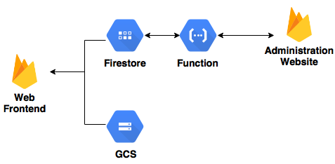

The architecture is fairly simple. The website is hosted with Firebase Hosting and connects to Cloud Firestore directly through the web client (rules allowing only read access). Static assets of projects (demo images) is stored in google cloud storage (GCS). Cloud Function (for Firebase) is used to built administration APIs and triggered to update related fields when a project is updated.

(In the future), an administration website is hosted to make it easier to update information. App Engine with task queue will be used for simple backup and restore of the database and assets.