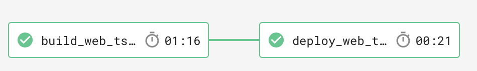

[CircleCI](https://circleci.com) is used as the continuous integration and continuous deployment (CI/CD) platform. There are three `workflow`s in the pipeline, for building and deploying the website, typescript document and design document respectively.

## The Website

The workflow has three jobs, `test_web`, `build_web` and `deploy_web`, for testing, building and deploying the website. These jobs are executed in sequential order, where latter jobs depend on former ones. Triggers are configured so that only commits on `master` or `release` branch will run all three jobs. Commits on feature branches will only trigger `test_web`. Commits on `master` branch will be deployed to staging environment (a separate Firebase project), where I can view the new version. If the website on staging environment looks good, merging `master` into `release` branch will trigger a deployment to production environment. Staging and production configuration is set in environment variable with different name. Scripts in the `deploy_web` job will check the current branch and use the corresponding environment variables for deployment. Detail of each job can be found in the following sections.


[CircleCI Configuration YAML](https://github.com/sevenlol/Portfolio/blob/master/.circleci/config.yml)

### test_web

The steps of this job is listed below. Test results are exported using junit exporter and uploaded as an artifact to CircleCI. This allows CircleCI to parse the test results and show statistics on previous tests.
1. checkout the commit that trigger this job
2. restore npm dependencies from cache (checksum of package.json is used as cache key)
3. install npm dependencies (noop if cache found)
4. save cache
5. run linting command for static analysis
6. perform unit tests
7. upload test results as artifact

### build_web

This job build the website with production mode. Since Angular does not support its environment file referencing environment variables, a separate script is implemented to retrieve firebase website configurations in corresponding environment variables based on the current environment (`staging` or `production`). Firebase configuration is then written to `environment.production.ts` by the script.

1. checkout the commit that trigger this job
2. restore npm dependencies from cache (checksum of package.json is used as cache key)
3. configure angular environment ts file based on current environment (`master` branch for `staging`, `release` for `production`).
4. build the website in production mode (optimization enabled)
5. store the built website in cache (branch + commit sha1 as cache key)


### deploy_web

This job deploy the website built in `build_web` job to Firebase Hosting using firebase command line tool. Firebase project name and token is set in environment variables, `FIREBASE_PROJECT_<ENV>` and `FIREBASE_TOKEN_<ENV>`, where `<ENV>` is the current environment (`STAGING` or `PROD`). For example, when a commit is pushed to `master` branch, `<ENV>` will be set to `STAGING`. `FIREBASE_PROJECT_STAGING` and `FIREBASE_TOKEN_STAGING` will be used in firebase command line tool to deploy the website.

1. checkout the commit that trigger this job
2. restore npm dependencies from cache (for firebase cli)
3. restore built website from cache (branch + commit sha1 as cache key)
4. deploy to the correct firebase project use firebase CLI.

## Typescript Document

This `workflow` has two jobs, `build_web_ts_doc` and `deploy_web_ts_doc` for building and deploying typescript document website to github page (on another repo). In order to deploy to another repository, a machine [user key](https://circleci.com/docs/1.0/github-security-ssh-keys/) is setup. A custom script is used to fetch the target repository, override old version with newly built document webiste, and push to `gh-pages` branch.

### build_web_ts_doc

This job build the typescript document with `Typedoc` command.



1. checkout the commit that trigger this job
2. restore npm dependencies from cache
3. install npm dependencies (noop if cache found)
4. save cache
5. build typedoc
6. save built typescript document website to cache (branch + commit sha1 as cache key)

### deploy_web_ts_doc

Target repository name is stored in an environment variable.

1. checkout the commit that trigger this job
2. restore built document from cache
3. push to `gh-pages` branch on target repository

```bash
git init
git remote add --fetch origin ${WEB_TS_DOC_REPO}
git config --global user.email ${GITHUB_EMAIL}
git config --global user.name ${GITHUB_NAME}
if git rev-parse --verify origin/gh-pages > /dev/null 2>&1
then
    git checkout gh-pages
    git rm -rf .
else
    git checkout --orphan gh-pages
fi
cp -a ~/project/web/doc/. .
git add .
git commit -m "document"
git push --force --quiet origin gh-pages > /dev/null 2>&1
```

## Design Document

