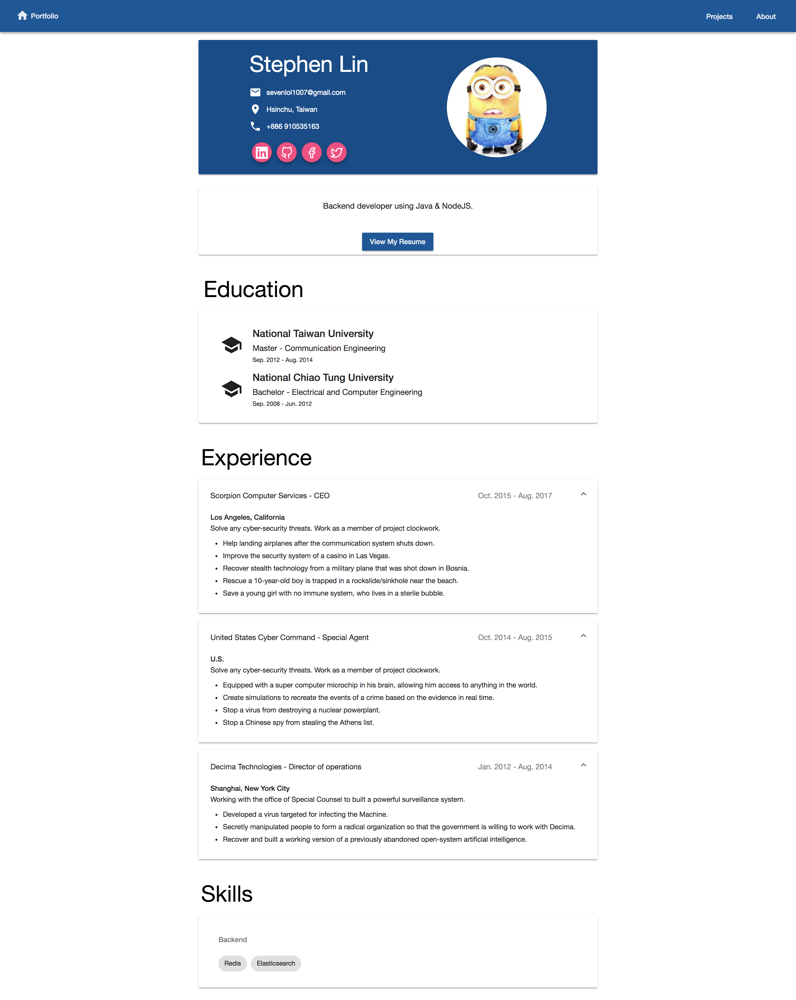
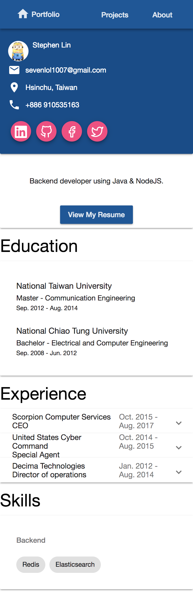

Path `/about` will be redirected to this module, currently only containing one path. My full information is displayed in the top section, followed by a summary of me and my resume link. Education and work experience information is shown in the next two sections, in reverse chronological order. Education data is loaded all at once because the data is unlikely to grow. On the other hand, the work experience is paginated and only load the most recent ones initially because they are more important and the amount of data is expected to grow. The last section display my software development skills grouped by skill category, such as backend or frontend.

Images of the desktop and mobile layout are at the bottom of this page.

## Information and Education

Information and education data starts to load when the component is initialized. In the meantime, a spinner is displayed.

## Work Experience

Work experience items are displayed in expansion panels. When the panel is collapsed, only job title, company name and work start/end date is displayed. If the user expands the panel, hightlights of this job will be displayed. In desktop layout, all panels are expanded by default for easier access to highlights. In mobile layout, all panels are collapsed by default in flat mode (no space in between) to save space. A button is placed at the button when more work items can be loaded. This is used instead of automatically loading new data when scrolled down because old work experience is less important and not many people are interested in (at least imo).

For future improvements, again, the work/skill data should be loaded in parallel. Also, different strategy of expanding/collapsing panels can be considered. Buttons should be added for expanding/collapsing all panels.

## Skills

Skill items are grouped into related categories (e.g., Backend Development). Each item contains the name of the skill (e.g., Angular), a short description (as tooltip when hovered) and a link to the its website. The number of categories is not expected to grow much. Therefore, all data are loaded together.

## Screenshots

