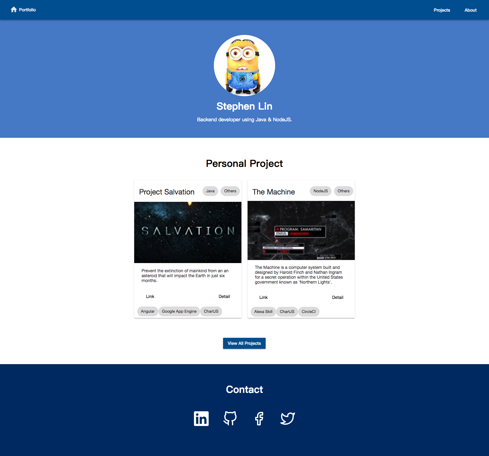

Path to the root path `/` will be redirected to the root path of home module `/home`. The top section of this page contains basic information about me, including my full name, avatar and a short description. My (featured) personal projects are displayed in the following section. I try to keep the home page clean by displaying only the most important (imho) projects here. The bottom section contains icon links to my profile pages (github, linkedin, etc).

Images of the desktop and mobile layout are at the bottom of this page.

## Navigation Bar

Navigation bar is actually in the root component. It includes a link to home page, project list page (triggers lazy loading project module) and about page (triggers lazy loading about module).

## Introduction and Contact Info

Home route is guarded by a resolver service that make sure introduction and contact info data are retrieved before finishing navigation. While the data is being loaded, a spinner is displayed and the home component is hidden.

## Featured Projects

After basic information and metadat is resolved, featured project component is initiated and project data starts to load. During this time, a separate spinner is displayed in the **featured project component** (while other data is displayed). Pagination is not used here because there should not be too many featured projects. I don't want to distract users by putting too many projects in the home page. I have considered adding a section for skills and decided not to because of the same reason.

For future improvements, I probably should load featured projects in parallel (when basic information is being loaded) instead of sequential. Also, I am considering either set a hard limit of featured projects in the administration API, or have a `Function` to removed oldest featured project if the limit is exceeded.

## Screenshots

