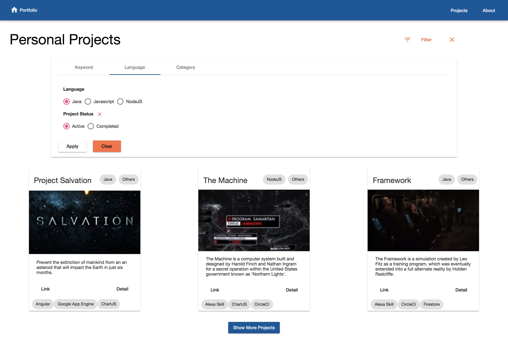
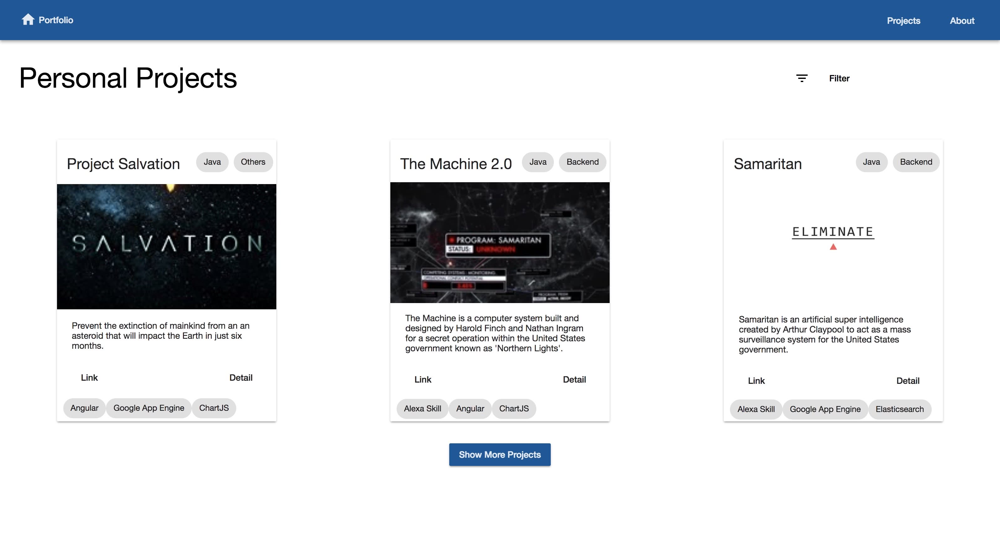
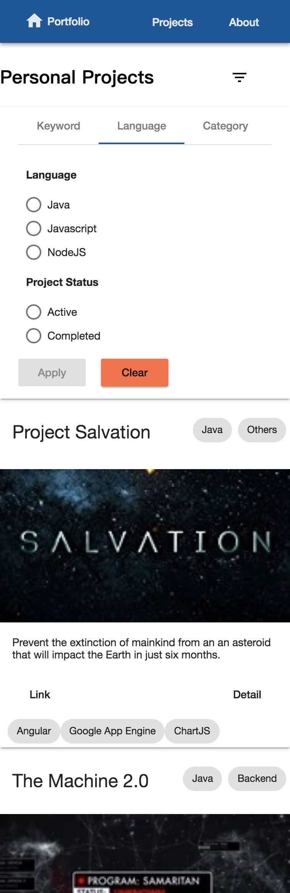
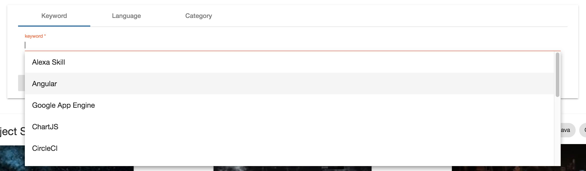
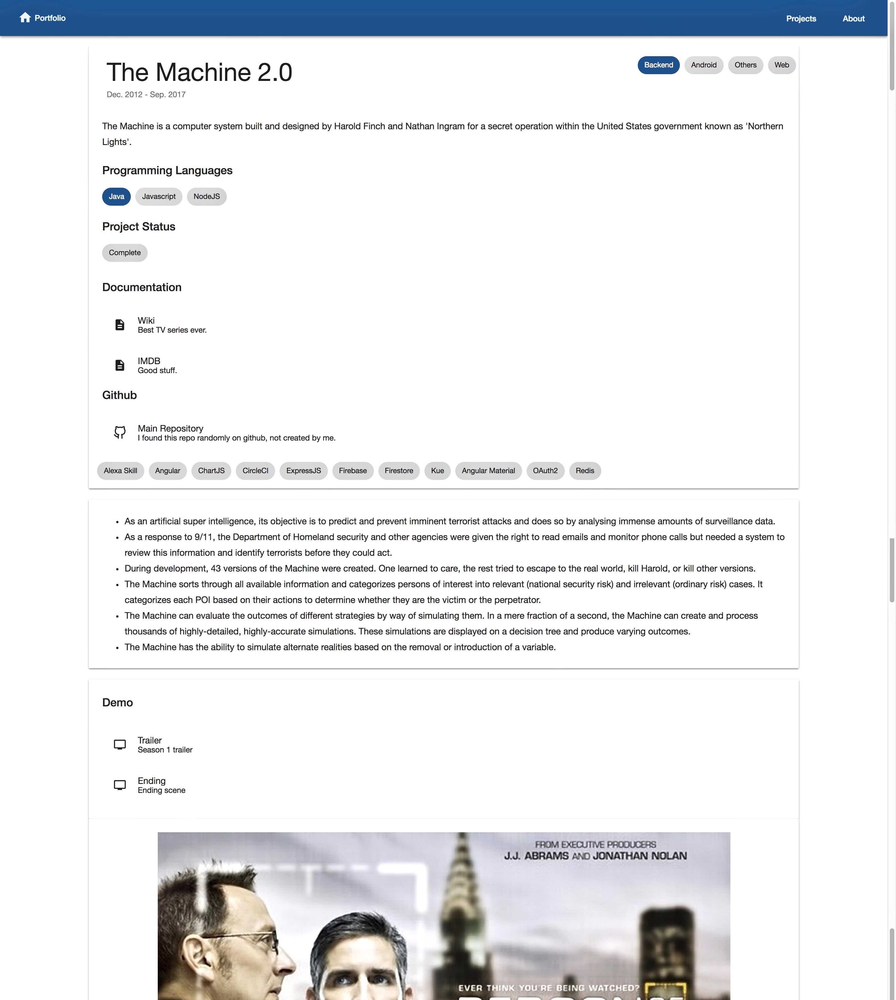

Path `/projects` will be redirected to this module, which contains two paths, `/projects/` for project list and `/projects/:id` for a specific project. Project list page has a filter panel that can users choose to view projects written with certain programming language, in certain category, or tagged with specified keyword. The user can also filter projects based on their status (still being actively developed or completed).

Project list page shows paginated projects in a grid list that adjust the number of projects per row based on the current window width. Each project is displayed in a card component, with essential information such as project name, description, primary language/keywords/category and links to detail page and project website. Project detail page contains additional information such as highlights, links to documents, github repo, and demo images/videos.

## Project List Page

There is a button at the top right corner of this page for collapsing/expanding the filter panel. This button turns into orange when a filter is applied (with an additional button for clearing the filter). Projects are displayed in a grid list that uses `ObservableMedia` provided by angular flexlayout to adjust number of project tiles per row dynamically.

Project data is paginated and only the first page is loaded initially. Whenever a filter is applied or the user clicks the button to load the next page, a query must be constructed correctly. This is achieved by using `distinctUntilChanged` on filter panel's `queryChange` event (which emits whenever a filter is applied/cleared) and combined with another observable on the next page event with `combineLatest` operator. A resulting observable containing the correct query is then generated with a `switchMap` operator (which cancels the previous observable) so that not too many observables are subscribed at the same time. A problem with the current design is that only the current page will be updated in real time.

For future improvements, infinite scrolling (load data automatically when scrolled down) is a good option. Additionally, dynamically subscribing/unsubscribing to the observables representing **the page users are currently viewing** can update the project data in real time while not subscribing to unecessary observables (wasting resources).

## Project Tile

Each tile in the grid list is a card component, displaying basic information for one project. The card header contains the project name and the primary language/category. The card content shows a cover image and a short description. Following the description is the action bar and footer, two links (project website and project detail page) are in the action bar while keywords are displayed as chips in the footer. Only a limited amount of keywords (currently 3) can be displayed.

For future improvements, make it easier to configure the precedence of keyword and/or the limit of displayed keywords.

## Filter Panel

Filter panel is consisted of three tabs, representing three types of filter. The first tab is for keyword filtering. It has a autocomplete input for selecting keywords. The second tab filters projects by programming languages and status (optional). The final tab filters projects by category and status (optional). Projects will be sorted in reverse chronological order, supported by creating additional Firestore index. Project status filter can be set or clear independently. To apply a filter, click the apply button in the panel (does not automatically apply when selecting filter value).

For future improvements, keep filter information in query parameter to persist between refreshes. Currently, switching between tabs clear the cached filter values. Each tab's values and the current set filter value should be cached independently.

## Project Detail Page

This page shows detailed information about a project. The top section contains all the basic information in the project tile, where all languages/categories/keywords are displayed (not only the primary ones). In addition, a list of documentation and github repository links is present. The following section shows the highlight text. At the bottom, a list of demo video links and demo images are displayed.

For future improvements, add links to the next and previous project. WYSIWYG is pretty nice but I am not sure I will ever needs it.

## Screenshots

