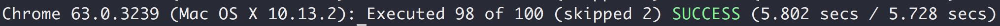
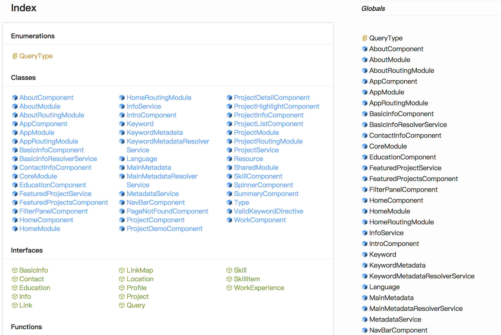

## Unit Tests

Unit tests are performed with the regular Angular stack, [Jasmine](http://jasmine.github.io/2.4/introduction.html) and [Karma](https://karma-runner.github.io/1.0/index.html) with the assistance of Angular testing utilities. Currently, there are 100 specs for testing components and services.

Services are tested by stubbing out dependencies and tested with different sets of input. Services are injected with angular testing utilities at the moment.

Components are with stub services and data. For read-only components, different fake data is set to the corresponding properties/services and tests if the DOM elements are displayed correctly. For components involving user actions, the corresponding public function of the component will be called in different ways to simulate user actions. Component properties and DOM elements are tested during and after the simulated actions to make sure the component is functioning as expected.

For future improvements, isolated unit tests for services should be implemented (without angular injection). More specs should be implemented to provide better coverage. Finally, commonly used stubs should be extracted to a common place and spies should be used to verify function invocations.

## E2E Tests

Protractor is used for writing E2E tests. However, protractor does not interact very well with websocket services (AngularFire2 uses websocket). Therefore, E2E tests are postponed and will be investigated once unit tests are more complete (most of the improvements are done).

## Typescript Document

Typescript documents is generated with [Typedoc](http://typedoc.org/). Typedoc command is used to transform typescript file comments into static html files. These files are then hosted on Github Page. The process is also automated and triggered by git commits. For more information, see [CI/CD](ci_cd.md) page.

Currently, typedoc does not work well with angular annotations (ngmodules, input, etc). In the future, I should find a way to organize the documents by angular module and document input/output annotations automatically (currently documented manually).

## Design Document

Design documents are written in markdown and built into html pages with [Docusaurus](https://docusaurus.io/). Files are sitting in a separate git repo and hosted on Github Page.
